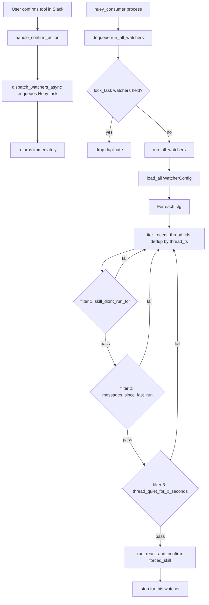

## Layout

New folder `common/watchers/` containing:

- [common/watchers/watcher_config.py](common/watchers/watcher_config.py) — frozen dataclass + `validate_watcher_config(raw: dict)` (validate-then-act). Fields exactly match the user spec:

```python
@dataclass(frozen=True)
class WatcherConfig:
    name: str
    trigger: str  # only "any_tool_confirmation" supported for now
    requester_user_id: str
    channel_id: str
    run_skill_id: str
    thread_started_after: int  # seconds
    skill_didnt_run_for: int
    thread_had_more_than_x_messages_since_last_skill_run: int
    thread_quiet_for_x_seconds: int
```

Validation: required fields non-empty; ints non-negative; `run_skill_id` must satisfy `progressive_disclosure.is_safe_skill_folder_name`; `trigger == "any_tool_confirmation"`.

- [common/watchers/watchers_root.py](common/watchers/watchers_root.py) — `watchers_root() -> Path` (`~/.open_slack_copilot/watchers`); `load_all() -> list[WatcherConfig]` reading `*.json`, logging and skipping invalid files.

- [common/watchers/eligible_thread_finder.py](common/watchers/eligible_thread_finder.py) — dumb iterator that yields **each distinct `thread_ts`** (string only) from paginated `conversations.history`, in API order (channel-history order = root-message `ts`). The filter chain lives in `watchers.py`, not here, so the iterator stays reusable and cheap-to-test:

```python
from typing import Iterator

def iter_recent_thread_ids(channel_id: str, oldest: float) -> Iterator[str]:
    """Yield each distinct thread_ts with root ts >= oldest, in channel-history order."""
    seen: set[str] = set()
    cursor = None
    while True:
        kwargs = {"channel": channel_id, "oldest": str(oldest), "limit": 200}
        if cursor:
            kwargs["cursor"] = cursor
        res = slack_api.get_client().conversations_history(**kwargs)
        for m in res.get("messages", []):
            tts = (m.get("thread_ts") or m.get("ts") or "").strip()
            if tts and tts not in seen:
                seen.add(tts)
                yield tts
        cursor = (res.get("response_metadata") or {}).get("next_cursor")
        if not cursor:
            return
```

Notes:
- Ordering is by **root message `ts`** (channel-history order), not last-thread-activity. Replies never appear in `conversations.history` (except `reply_broadcast`), so a thread whose root is older than `oldest` is excluded even if it had a recent reply.
- Generator-based so the caller `break`s on first match — we don't over-paginate.
- No retries / error swallowing here; the watcher worker logs and moves on if Slack errors bubble up.

- [common/watchers/watchers.py](common/watchers/watchers.py) — `find_first_eligible_thread(cfg)` and `run_watchers_for_trigger(trigger="any_tool_confirmation")`. The picker is a small inline loop over `iter_recent_thread_ids`; no separate `find_thread(filter_fn)` abstraction (KISS — one caller).

```python
def find_first_eligible_thread(cfg: WatcherConfig) -> str | None:
    oldest = time.time() - cfg.thread_started_after
    for thread_ts in iter_recent_thread_ids(cfg.channel_id, oldest):
        if _passes_filters(cfg, thread_ts):
            return thread_ts
    return None
```

`_passes_filters` runs the three checks in this order (cheapest first):

  1. **`skill_didnt_run_for`** — query `skill_runs` for the most recent run for `(cfg.run_skill_id, cfg.channel_id, thread_ts)`. If it exists and `now - last_skill_run_ts < skill_didnt_run_for` → skip. **No `conversations.replies` call yet** — this filter rejects most threads cheaply.
  2. **`thread_had_more_than_x_messages_since_last_skill_run`** — only now fetch the full thread via `slack_api.read_thread(cfg.channel_id, thread_ts)`. Count messages with `float(m["ts"]) > last_skill_run_ts` (or all messages if no prior run). If count `<` threshold → skip.
  3. **`thread_quiet_for_x_seconds`** — last message ts from the same fetched thread; if `now - last_msg_ts < thread_quiet_for_x_seconds` → skip (thread not quiet long enough).

  When a thread passes, call:
  ```python
  run_react_and_confirm(
      channel_id=cfg.channel_id, thread_ts=thread_ts,
      recipient_user_id=cfg.requester_user_id,
      prepare_user_id=cfg.requester_user_id,
      user_text="",
      context_kind="thread",
      forced_skill_folder=cfg.run_skill_id,
      copilot_trigger="watcher", copilot_action=f"watcher:{cfg.name}",
  )
  ```
  and stop (one watcher run picks at most one thread).

- [common/watchers/watchers_unit_test.py](common/watchers/watchers_unit_test.py) and [common/watchers/watchers_integration_test.py](common/watchers/watchers_integration_test.py) — mock Slack + LLM per project rules.

## skill_runs query helper

Extend [common/skill_runs/skill_runs.py](common/skill_runs/skill_runs.py) with a thread-scoped lookup (the current API is key-based only):

```python
def find_latest_run(skill_id: str, channel_id: str, thread_ts: str) -> dict | None:
    rows = (r for r in _collection().values()
            if r.get("skill_id") == skill_id
            and r.get("channel_id") == channel_id
            and r.get("thread_ts") == thread_ts)
    return max(rows, key=lambda r: r.get("action_ts") or "", default=None)
```

This requires a tiny extension to the file backend: confirm/extend `KeyValueCollection.values()` (or `iter_rows()`). Brief peek at [common/data_layer/file_key_value_collection.py](common/data_layer/file_key_value_collection.py) before writing — add `values()` if missing.

`last_skill_run_ts` is parsed from the latest row's `action_ts` (ISO-8601) via existing `common/date_utils.py` helpers.

## Hook into "any tool confirmation"

A tool confirmation in Slack is treated as a sign that the copilot user is online and we may want to evaluate watchers. Hook point: [common/slack/slack_bot/tool_confirmation.py](common/slack/slack_bot/tool_confirmation.py) inside `handle_confirm_action` after the confirmed tool successfully executes. Watcher-initiated runs that themselves end in a tool confirmation are also valid online signals — **no recursion guard** is needed because the dispatch is asynchronous and the watcher's own filters (`skill_didnt_run_for`) prevent re-firing on the same thread.

```python
from common.watchers import watchers
watchers.dispatch_watchers_async("any_tool_confirmation")
```

`dispatch_watchers_async` MUST be non-blocking — it only **enqueues a Huey task** and returns. No work runs in the Slack listener path.

## Background dispatch: Huey + SQLite, one task for all watchers

**Why Huey (SQLite) over APScheduler/file-queue?**
- Native cross-process producer/consumer with a real durable queue (SQLite WAL), not hand-rolled file polling.
- `@huey.lock_task` gives us first-class deduplication: bursts of tool confirmations collapse into one run.
- Already a small dependency; no Redis/broker needed.
- APScheduler stays in [prompt_scheduler](common/tools/prompt_scheduler/prompt_scheduler.py) for cron (same-process). Watchers use Huey for cross-process queueing.

### Huey app

New file [common/watchers/huey_app.py](common/watchers/huey_app.py):

```python
from pathlib import Path
from huey import SqliteHuey

_HUEY_DB = Path.home() / ".open_slack_copilot" / "huey.sqlite3"
_HUEY_DB.parent.mkdir(parents=True, exist_ok=True)

huey = SqliteHuey(name="open_slack_copilot", filename=str(_HUEY_DB))
```

The same Huey instance is imported by both the bot process (producer) and the consumer process. SQLite locking handles concurrent producers; the consumer process is the single executor.

### Single task for ALL watchers

In [common/watchers/watchers.py](common/watchers/watchers.py):

```python
from common.watchers.huey_app import huey

@huey.task()
@huey.lock_task("watchers")  # only one run_all_watchers in flight at a time
def run_all_watchers(trigger: str = "any_tool_confirmation") -> None:
    for cfg in load_all():
        try:
            _evaluate_watcher(cfg)
        except Exception:
            _logger.exception("watcher %s failed", cfg.name)


def dispatch_watchers_async(trigger: str = "any_tool_confirmation") -> None:
    run_all_watchers(trigger)  # enqueue, returns immediately
```

`@huey.lock_task("watchers")` is the dedup primitive: while one `run_all_watchers` execution holds the `watchers` lock, additional enqueues raise `TaskLockedException` inside the consumer and are dropped — exactly the "burst of confirmations does not N× scan" behavior we want, with no hand-rolled coalescing.

A single task iterating all configs (rather than one task per watcher) is simpler, cheaper, and matches the user's instruction ("still one job for all watchers"). Per-watcher failures are isolated by the inner `try/except`.

Add `huey>=2.5` to [requirements.txt](requirements.txt).

## Worker / consumer process & Make targets

The consumer is just the standard Huey CLI — no custom worker file:

- `make watcher_worker` runs:
  ```
  PYTHONPATH=. .venv/bin/huey_consumer common.watchers.huey_app.huey
  ```
- Importing `common.watchers.huey_app` triggers `import common.watchers.watchers`, which registers the `run_all_watchers` task with the shared `huey` instance. Add an explicit re-export in `huey_app.py` if needed to guarantee task registration:
  ```python
  from common.watchers.watchers import run_all_watchers  # noqa: F401  (register task)
  ```

Makefile targets (parity with `scheduled_prompts`):

- `watcher_worker` — `python -m common.watchers.watcher_worker` (long-running).
- `watchers_list` — print each watcher config + last matched thread (if any).
- `watchers_run_once` — invoke `run_watchers_for_trigger("any_tool_confirmation")` once, in-process (for debugging).

## Example config

`~/.open_slack_copilot/watchers/summarize_active.json`:

```json
{
  "trigger": "any_tool_confirmation",
  "requester_user_id": "U123ABC",
  "channel_id": "C0123ABC",
  "run_skill_id": "summarize_thread",
  "thread_started_after": 604800,
  "skill_didnt_run_for": 7200,
  "thread_had_more_than_x_messages_since_last_skill_run": 3,
  "thread_quiet_for_x_seconds": 3600
}
```
(`name` is derived from filename stem.)

## Data flow



## Key design points

- **Trigger = sign-of-online**: any successful tool confirmation in Slack indicates the copilot user is online; that's the only event that wakes watchers in v1.
- **No recursion guard**: watcher-initiated runs that get tool-confirmed are equally valid online signals; per-thread re-firing is prevented by the `skill_didnt_run_for` filter.
- **Per-thread iteration**: `iter_recent_thread_ids` yields one entry per distinct `thread_ts`, so the filter chain is evaluated per thread, never per message.
- **Asynchronous dispatch**: the Slack confirmation handler MUST NOT block. Dispatch only enqueues a Huey task on the SQLite queue at `~/.open_slack_copilot/huey.sqlite3`; the watcher loop runs in a separate `huey_consumer` process (`make watcher_worker`).
- **Burst dedup**: `@huey.lock_task("watchers")` ensures at most one `run_all_watchers` execution at a time; concurrent enqueues are dropped by Huey, replacing hand-rolled coalescing.
- **Single task for all watchers**: one `run_all_watchers` task iterates `load_all()`; per-watcher errors caught locally so one bad config does not skip the others.
- **Skill invocation**: `run_react_and_confirm` with `forced_skill_folder=run_skill_id`; `requester_user_id` from config is both the prepare and recipient user.
